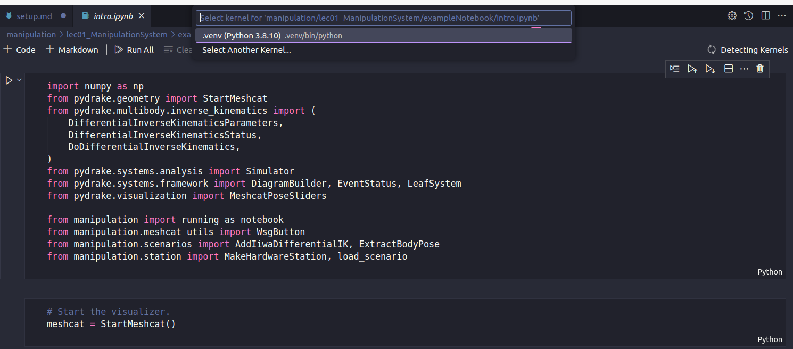

An long term on-going attempt to rebuild knowledge on manipulation and locomotion

## Course Website

Great thanks to Prof. [Russ Tedrake](https://groups.csail.mit.edu/locomotion/russt.html). My knowledge are out of date, I have to rebuild my knowledge by going through your lectures.   
* **[Underactuated Robotics](https://underactuated.csail.mit.edu/)**: <br> Lecture focusing on locomomtion, i.e. modelling, controls, estimation and learning   
* **[Robotics Manipulation](https://manipulation.csail.mit.edu/)**: <br> Lecture focusing on manipulation, i.e. perception, motion planning, dynamics & control, higher level task planning


## Run Jupyter Notebook Locally

* The two courses' notebooks are suggested to run online by deepnote. It is cool and convenient. However, there are a lot github and third-party dependenices. It gonna slow down your execution and debugging process especially if you are in mainland China. Creating and setup your own local environment to run those notebooks gonna save you a lot of time in the long run.
* You don't need to git clone **[drake](https://github.com/RobotLocomotion/drake)** and build from source, online **[Jupyter Notebooks](https://manipulation.csail.mit.edu/drake.html#notebooks)** contains everything you need to follow the lectures. 
* Environment Setup
    * I am using ubuntu 20.04 and run these notebook locally on vscode, everything works fine.
    * Follow [this link](https://manipulation.csail.mit.edu/drake.html#section3) to run on your own machine. These are the commands I used to setup my environment: 
    * ```bash
        python3 -m pip install --upgrade pip
        pip install ipykernel
        pip install pydrake
        pip install manipulation --extra-index-url https://drake-packages.csail.mit.edu/whl/nightly/  
        pip install nbformat nbconvert
        ```
    * I created my virtual environment inside vscode extensions, and then do the pip installs. It bypasses several potential module-importing problems. 

## About this repo
* *Lec_transcripts*: <br> These are lecture transcripts generated by GPT4
* *Lec_Notes*: <br> notes taken by me
* *Lec_ipynb*: <br> Jupyter Notebooks for the lectures