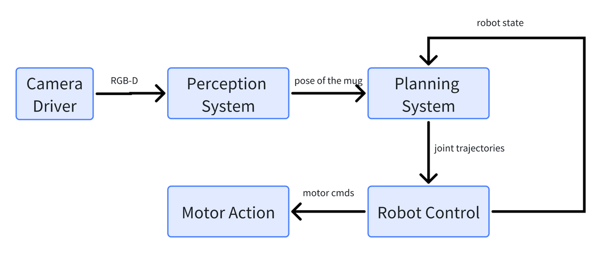
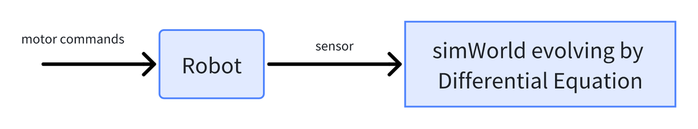

# Introduction to Robotic Manipulation
Robotic Manipulation definition: [SHAP](https://shap.ecs.soton.ac.uk/index.php)
Manipulation is much more than grasping.

# Deep Dive: The Components of Robotic Manipulation
- To be clear: we are controlling: **state of the robot + state of the object(part of environment)**
- People start to use deep learning (Visuomotor policies), from image to robot actions. It has intermediate layers that are learning implicity state representations of the world.
- High level motivation, from control perspective, doing manipulation would have been extremely hard.

# Lecture Contents
This course will try to accomplish building a manipulation system that can do a full stack task move all objects from bin A to bin B. The lecture in semeter will be spiral through these four topics:
- **Perception**: by geometric perception, which leverages the principles of kinematics and geometry; or by data-driven perception, where deep learning plays a pivotal role.
- **Motion Planning**: add more mobile manipulation content this time
- **Dynamics & control**: Contact Mechanics, multi-body dynamics and manipulator control
- **Higher level Task Planning**: Beyond the physical interaction, robots need to plan and execute sequences of actions to accomplish broader objectives. This involves higher-level reasoning and decision-making capabilities.

# Introduction of ROS operating system
- 
- Ros node is an executable.  Sense-Plan-Act paradigm in AI, super useful.
- Each ros node can be wrapped up with docker
- Help us start to modularize and compartmentalize some of the complexity of building a big system

# Model-based Design
- 
- $x[n+1]=f(x[n], u[n])$, x: state of robot; u: input motor commands
- $y[n]=g(x[n], u[n])$, sensing, can be camera, very complicated, g can be render. 
- Knowing the state and controller input, we can actually do rewind simulation or even Monte Carlo simulation

# Drake Core Library: drake.mit.edu
- Modeling Dynamical Systems
- Solving Mathematical Programs
- Multibody Kinematics and Dynamics
- Combined with really nice optimization library built in Drake
- [Drake tutorials](https://drake.guzhaoyuan.com/)
- Drake simulation to deployment on machine, two steps:
  - Make it run all in one simulation okay
  - Run on a remote robot but not turning on the robot, instead turn on a simulator on another computer and make sure it works on a remote simulator with all the messages passing and nothing blows up. Turn off the above simulator, turn on the robot
- From software engineering perspective:
  - Drake, object-oriented programming classes provide levels of tools for encapsulation and abstraction. Allow you to build incredibly complicated systems in the dynamical systems world.

# Students' Questions:
1. If we know the environment (like liquid) physics, do we incorporate them into the neural network?
  - Simple answer: we are almost ignoring it. But there is a very active field of research of trying to do physics inspired neural networks. Trying to bring in those biases from mechanics & dynamics. 
  - Trade off is: everytime you inject your knowledge of the world you corrupt the system and you've limited what the network is capable of learning. But on the other hand, you made it more data efficient. So there is a trade off.
2. Abstraction of port in simulation/hardware
  - The physics engine is loaded with all the objects and the cameras in order to be able to render RGB images
  - The orange ports are cheat ports, ground truth values u can get access only in simulation, for development purposes.
  - You can write entire thing in Drake not use ROS message passing. Ros is really the communication layer which enalbed modular thinking.
  - Drake similarly enables modular thinking. In simulation, use drake without ros, all in one process, just to keep complexity down. If you want to run on hardware mode, hardware station interface, same input, output but inside. There are ROS sender, receiver, publisher. They handled network messaging to provide the same input & output abstraction in the signals and systems.
3. Gazebo and Drake
  -  Gazebo is the simulator component in Ros. Drake could be used instead of gazebo. Drake's physics engine can be used in Gazebo. Drake is more powerful and functional. There is no need to use gazebo in class.
4. Software/algorithm development environment setup?
  -  You can choose to download and install locally, probably a better experience.
  -  But for class, deepnote with python notebook on sky, no need to install anything. But there are limits on deepnote. Like single core of computing, etc.
  -  Typically, a lot of things will run on a single core unless you run locally and turn on multi-threading. 
5. Advantages of Drake over Gazebo
  -  The way gazebo/Ros runs, makes a complex dynamic system very hard to be repeatable. (message handling, timing etc)
  -  Drake is designed for that. Declare states, parameters and timing semantics in a consistent way. Deep understanding complex relationships. Easy to debug controllers.
6. Russ's view on google RT2
  -  "I think RT2 is good, it's the beginning of a future. But I think we are still in the place where we are taking what's amazing about language models and kind of bolting on the robot. And I think there is going to be a future where the robot data plays a bigger role in the common sense of understanding. Most things will become better because of the language model"