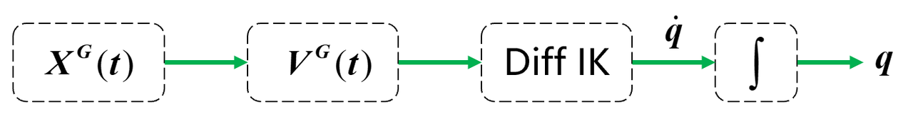

**Last Lecture** 
**1**: Kinematic Frames / Spatial Algebra
**2**: Gripper Frame Plan Sketch
**3**: Forward Kinematics of iiwa
**4**: Differential Inverse Kinematics

# Today's Topic: IK and Diff IK
- IK is very hard in general, but diff-IK is relatively easy
- Mapping from generalized velocity to spatial velocity: $J^{G}(q)v=^{W}V^{G}$



- **3D Rotations**:
  - Rotation matrix, 9 numbers, over-parameterized. Constraints: $R^{T}R= I_3,$ $\det(R)= 1$
  - Euler Angles, 3 numbers, no constraints. But [*gimbal lock*](https://iwant2study.org/lookangejss/math/ejss_model_glimbal8wee02/glimbal8wee02_Simulation.xhtml#google_vignette).
  - Angle-Axis, direction is axis; magnitude is angle. No constraints.
    - Very related to screw theory
  - Unit Quaternion [w,x,y,z], 4 numbers, 1 constraint: $w^2+x^2+y^2+z^2 = 1$
    - Using all the time
    - Call quaternion algebra by software methods
    - Minimal representation, 4 numbers + 1 constraint, singularity free
    - Still has some quirks, you can just flip your unit quaternion, not too bad.
    - The sequence, w-x-y-z is recommended. Some software may provide x-y-z-w, you can do a wrapping on that. 
    - The constraint makes unit quaternions living on the unit sphere.

- **Kinematic Jacobian, or just Jacobian**:
  - $X^{B}=f^{B}_{kin}(q) \\
  dX^{B}=\frac{\partial{f^{B}_{kin}(q)}}{\partial{q}}dq \\
  =J^{B}(q)dq$
  - The derivative of rotation, 3 numbers are enough, canonical solution. 

- **Spatial Velocity**:
  - $ \frac{\mathrm{d} }{\mathrm{d} t}^{A}X_{C}^{B}\equiv^{A}V_{C}^{B}=\begin{bmatrix}
  ^{A}w_{C}^{B}  
  \\ 
  ^{A}v_{C}^{B}
  \end{bmatrix}$, angular velocity is on the top, note the typesetting
  - Be consistent on your notations. There are three V's
    - spatial velocity $V$
    - generalized velocity $\dot{q}$
    - translational velocity $v$
  - Angular velocity has nicely magical addition property
  - Drake's methods:
    ```
    q=plant.MapQDotToVelocity(context, qdot)
    qdot=plant.MapVelocityToQDot(context, v)
    CalcJacobianSpatialVelocity()
    etc
    ```


  - Geometric jacobian (rarely used) vs kinematic jacobian

- Diff IK is to take Jacobian's inverse
  - $\dot{q}=[J^{G}(q)]^{\dagger}V^{G}$
  - Is Jacobian invertible? For most robotic arms you can buy on the market, it is invertible, full row rank.
  - Pseudo-inverse is an extremely good algorithm
    - For no solution case, pinv() gives you the best-effort solution. The reconstruction of $J\dot{q}$ will deviate V in a least-square sense.
    - For single solution case, pinv() returns it with more effort than inverse()
    - For infinite solution case, pinv() gives you the minimum norm-2 solution
  - Diff-IK
    - Finds exact solution if $J^{G}(q)$ is full row rank
    - What you need to watch is the smallest singular value, if it gets close to zero. You are going to generate big joint velocities.
    - In motion planning or teleoperation, you have to pay attention to the smallest singular value. Write protection optimization on your low-level controller

- Build up the diff-IK controller system
  - In Drake, write your own controller in the leaf system
    - Declare input, output ports
    - Use the provided class and methods
    - Do the calculation and set the output.

- How do we get from piecewise end-effector pose $X^{G}(t)$ to spatial velocity $V^{G}(t)$?
  - $X^{G}(t)$--Piecewise Pose. Lerp for translation. Slerp for rotation
    - `get X_G_traj`
    - `V_G_traj = X_G_traj.MakeDerivative()` is a PiecewisePolynomial
  - The Diff-IK controller has no control on singularities. Has to come up with a better one if you want to run it on a real iiwa.

# Questions:
1. **Rotation mapping singularities**
   - Using rotation matrix and unit quaternion is complete.
   - Extrinsic RPY and Intrinsic RPY are different
2. **Generalized coordinates for different robot**
   - iiwa, q = 7*1, joint angles
   - brick, q = 7*1, xyz + unit quaternion
3. **Why rotations represented by 3 numbers there will be singularities, but angular velocity not?**
   - Because angles wrap around 2pi, but angular velocity does not. So 3 is enough, no more singularities.
4. **Can I take derivative of Jacobian?**
   - If its 6 DOF (rank = 6), you can. There is a canonical choice for Jdot
5. **About the continuous derivative method on Jacobian in drake, how does drake do it?**
   - Drake has discrete states and runs integration, either in fast Euler, your 4th order RangaKutta. There is a suite of integrators you can pick from.
   - Be careful when choosing derivation solvers. It has to match the simulation integration. Otherwise, it gonna generate unnecessary advanced optimization-based problem.
6. **Is 6 DOF robotic-arm good for applications?**
   - No, they are just mathematically beautiful. Extremely limited when picking things up.
   - Kuka iiwa has one more degree, but it is still hard to work in a kitchen sink. The wrist is too long.
