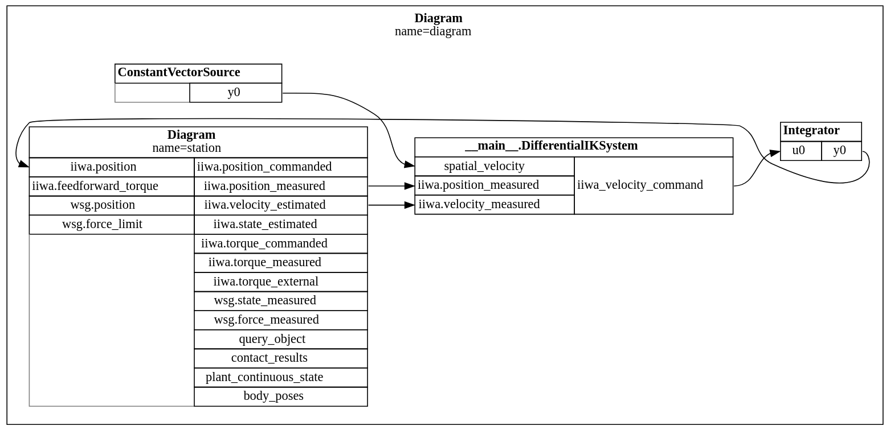
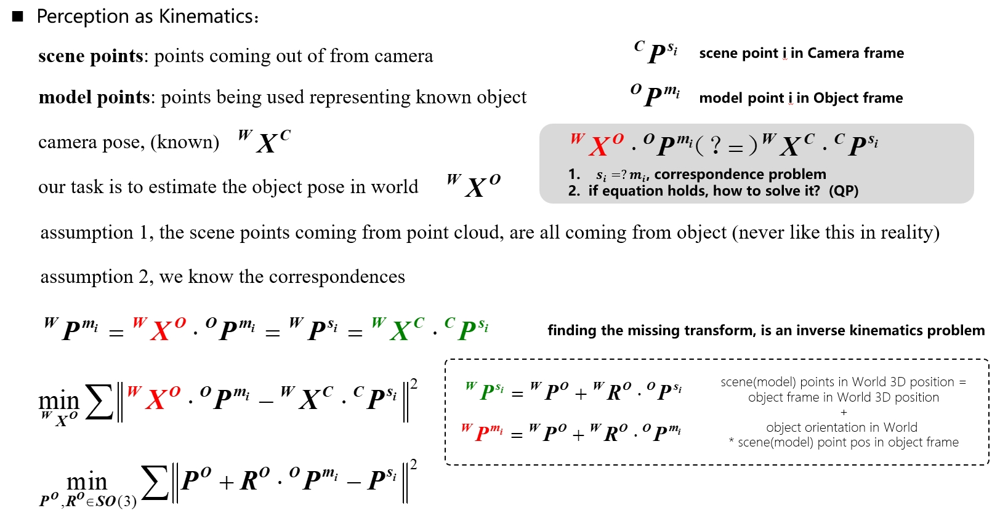
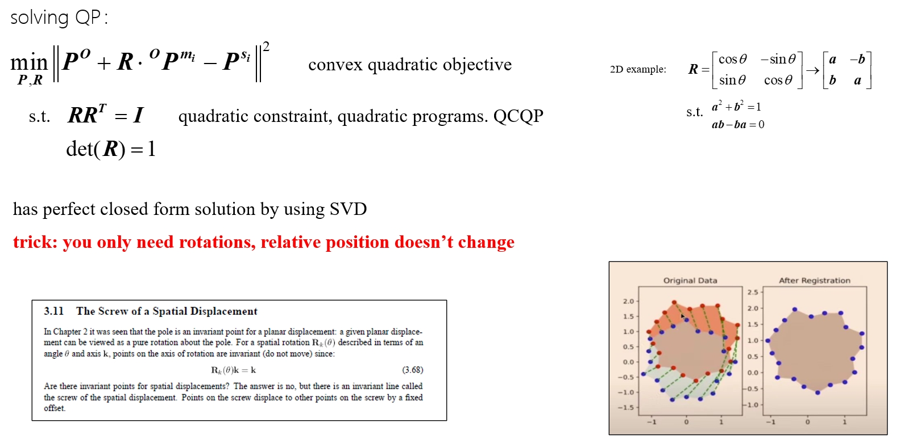

**Last Lecture** 

Gripper velocity are pre-given. Now we are moving into the perception part.

# Today's Topic: More geometric view of perception, old school of perception, fundation
- Going from image through a deep network is best for now. There are still a lot of perception tools based on fundamental of geometry
- [Dynamic fusion](https://www.youtube.com/watch?v=i1eZekcc_lM), algorithms that run in real time
- If the world doesn't change too much, we can write a simple algorithm to tracking and reconstruction.

## Geometry sensors -- lidar / time of flight
- Velodyne spinning lidar, Luminar, Hokoyu scanning lidar
- Only return depth information: Geometry sensors -- stereo. Carnegie multisense stereo, Point Grey Bumblebee
- Geometry sensors -- structured light. Microsoft Kinect, Asus Xtion, Intel RealSense
- Geometry sensors -- projected texture stereo. Intel RealSense D415 D435i
- RGB only, deep learning based. Like cellphone, in a single camera. Neural Radiance Fields
- **Leaned mapping from image to depth**: Drive a car around with two cameras on it. Use the second camera to stereo matching. Learning a model from the first camera images to depth. Then make a million of them. Take away the second and become a product.
- Pay attention to blurring from fast motions and timing it with the spinning laser

## Perception as a Kinematic Problem

## Convert into QP

## Correspondences, the famous ICP Algorithm
- Iterative Closest Point, introducing **correspondance vector**, $c_i=j$, an n*1 vector, point $s_i$ correspondance to model point $m_j$
- $\underset{c_i,X\in SE(O_3)}{min}\quad \sum\left \| X^0P^{m_{c_i}} - P^{s_i} \right \|^2$
- ICP does this in two steps to find the optimization
  - solve the nearest neighbor problem, $\hat{c}_i=\underset{j}{argmin} \left \| X^0P^{m_{i}} - P^{s_j} \right \|^2$
  - given correspondances, solve for X
  - repeat

# Questions
## 1. Image to depth computation, how to do it faster?
- **A**: Block matching stereo, simplest way to do it. You are doing more than that. Computation element: a 8 by 8 comparing with another 8 by 8. Doing with in a row for all possible pairs, running at full frame rates. Specialized hardware has a beautiful solution for it. 

## 2. Why is perception so hard?
- the rgbd to 2D, to 3D mapping is so hard. Same thing under different lighting conditions, different angles, different distances, will you entirely different images.
- RGB reveals much more info than depth nowadays

## 3. how is RGB-D image data structure?
- RGB convert to colored point cloud. Depth convert to depth point cloud, i.e. depth information on every pixel. It has min\max-distance limit, and resolution.