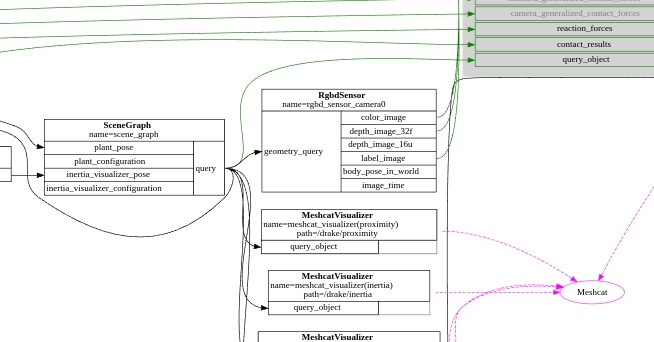

**Last Lecture** 
- Point cloud
- Point set registration
  - Known correspondences(SVD)
  - ICP. By finding correspondences based on nearest neighbors algorithm, for points just in the scene and points in the model. Saying they are corresponding if they are closest one and then assuming that was correct solving for pose given the known correspondences and then updating and running until converge.

# Today's Topic: Messy point clounds 
- soft correspondences
- outliers
- beyond correspondences based (point set registration)
- The rgbd sensor in the diagram. Can be rendered using OPENGL or other tools, or remotely using interface provided. Just adding camera in the model parser, the yaml file.
- 

## Soft correspondences, Real point clouds are messy
- Partial View. Correspondence vector, $c_i=j$, means scene i corresponds model point j. **not model to scene points**. Scene points are less than model points.
- Gaussian noise(lumps)
- Outliers. outlier scene points, they are far away from they should be, need to be removed. Outlers greatly affect ICP's result (pose)

## Correspondence matrix
- $C_{ij}={0,1}$, if scene point i correspondence to model point j, its 1.
- slightly more expensive optimization $\underset{X\in SE(3)}{min}\quad \underset{i}{\sum}\underset{j}{\sum} C_{ij}||X\cdot^{O}P^{m_j}-^WP^{S_i}||^2$
- If more than thousands points $C_{ij}$ would make the optimization hard to solve in real time
- Soft correspondence. $C_{ij}\in [0,1]$
  - Ex choose $C_{ij}$ from a Gaussian kernel (**Coherent Point Drift, CPD**), a variation on ICP
  - for each scene point, compute all the distance vs model points based on weights. Model points are close having more weight, points are far away with zero weight. Summing to 1, normalization.
  - **CPD is a lot more robust than ICP, but potentially a lot more expensive**
- The CPD's quadratic optimization has drawbacks: points far away contributed too much. The quadratic can be replaced by more general loss functions, like 
  - **Gaussian**
  - **Lorentzian**
  - **Truncated Least-Squares** 
  - **Huber Loss**
  - if the distance is less than 1, use quadratic. if its greater than 1, use 1. This will reward you for making as many inliers as possible
- Speed the computation. Using Signed Distance Function, to represent object boundary. Then computation become table queries.

## Problem you might encounter in real-world
- non-penetration constraints, if say mug on table
- static equilibrimu constraints
- free-space constraints. Camera shooting on item. the room in between are free space.
- when solving ICP, CPD, we can add these constraints
- $f(X^O)>=0$, distance of the closest point on mug to table is 0.
- free space constraints are being underestimated. They are so useful. **How to write free-space constraints in optimization landscape**?
  - turn it into a non-penetration constraint problem. Make a fake object between camera and object. People use it at real-time and tracking. 
  - **DART**, dynamical articulated tracking
- Other issue: few points matter so much more than others. like open the door sceanrio the door handle.
- Deep network challenges: have ground truth labels. ICP can be used for this. **[LabelFusion, a pipeline for generating ground truth labels for real RGBD data of cluttered scenes](https://www.youtube.com/watch?v=nc65CF1W9B0)**, deep pose estimation
- COLMAP ([Large scale structure from Motion](https://www.youtube.com/watch?v=pvvnPib4lFA)), ICP point correspondence solved at massive scales
  - giving a 3d map of rome. taking picture at random places, and using ICP to find where the camera is in the huge 3d map.
  - correspondence search is the first step. They use features not point clouds
  - no depth images used.
  - key, bundle adjustment, point set registration
  - SLAM, 3D reconstruction, bring raw images, use COLMAP to figure out where the cameras are is the first step.

# Questions
## 1. How to make a point cloud model
- Takem multiple cameras, and sample the objects from different angle and down into one 3D point clound

## 2. How to improve performance using same camera
- One way, choose to use depth info instead of RGB, cuz its less sensitive to camera properties and lighting conditions.

## 3. the goal of hardware abstraction
- is to be whatever the real robot is. We dont make point clouds come out of the hardware station. Cuz robot doesn't send u point cloud, its going to send you a depth image. So thats the layer of abstraction  the hardware station. The converge of RGB and depth image you have to do it in your algorithm layer

## 4. How to get away of partial views? 
- Get more cameras, do the calibration. 
- And the final solution is learning

## 5. Is CPD algorithm iterative like ICP
- Yes. Give initial pose guess $X$, compute the gaussian kernal distances, score them with a bell curve. Then get $C_{ij}$
- Then solve the point registration problem, weighted by $$\underset{X\in SE(3)}{min}\quad \underset{i}{\sum}\underset{j}{\sum} C_{ij}||X\cdot^{O}P^{m_j}-^WP^{S_i}||^2$$, which can be solved by SVD. get a new pose
- alternate the above two steps

## 6. How does CPD handles Outliers? be careful on the normalization
- by default, set a small weight on outliers

## 7. What the Outliers look like in real world?
- not needly in haystack anymore (in old days a good intial guess is required to get a accurate pose)
- nowadays, segmentation and neutral network now are so good

## 8. ICP CPD VS. Deep network or neutral network
- NN are so good, but knowing the geometry and use CPD/ICP local can get accurate results.
- Deep learning to get initial guess. Geometric perception to fill in the details
- Deep learning winning Geometric approach after 2020, competition of estimation object's pose

## 9. What if scence points not evenly distributed alone boundaries?
- Soft correspondence solves this
