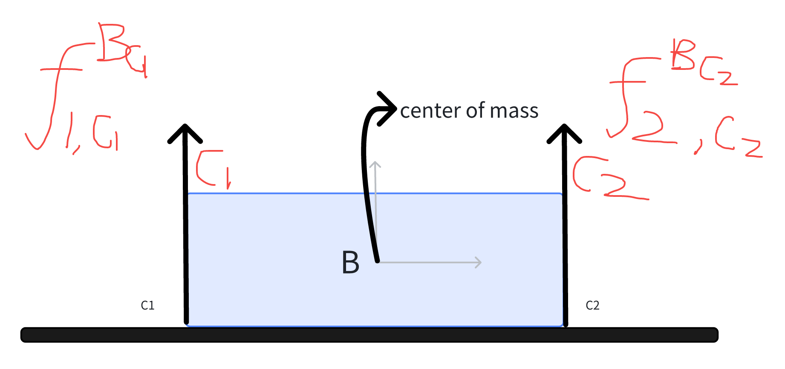

**Last Lecture** 
1. Hardware basics(iiwa + WSG)
2. Basic pick and place  
   - Kinematics / jacobian based control
   - moved a single known object assuming known pose
3. Geometric perception
   - pose estimation from depth for a single known object

## This week's Topic: 
- more complex scenes (many objects / diverse objects)
- still relatively simple manipulation(pick & place)
- try to build a "clutter" clearing at kitchen etc
- we are going to generalize perception system, build more complicated simulation, higher level state machine

## Simulation
1. How to generate diverse random simulations?
- Its actually pretty hard
2. Contact simulation
- Random dropping YCB objects and calculation the contact force to find a static equilibrium is actually doing a lot of work.
3. Spatial Forces
- $F = \begin{bmatrix}
\tau\\F 
\end{bmatrix}$
- $F_{name,C}^{B_P} = \begin{bmatrix}
\tau_{name,C}^{B_P}\\F_{name,C}^{B_P} 
\end{bmatrix}$, 6*1 vector, top 3 is rotational
- name: the name of the force; C is the force being expressed frame, $B_P$ is point where force is applied, recommendation use the body in the point name
- Spatial force addition: $F_{total,C}^{B_p} = \underset{i}{\sum}F_{i,C}^{B_p}$
- Shifting a spatial force from one application point, B_p, to another point, B_q, uses the cross product:
$f_{C}^{B_p}= f_{C}^{B_q}, \tau_{C}^{B_q}=\tau_{C}^{B_p} + ^{B_q}P_{C}^{B_p}\times f_{C}^{B_p}$
- spatical force/torque representing in different frame
$f_{D}^{B_p}=^{D}R^{C}f_{C}^{B_p}, \tau_{D}^{B_p}=^{D}R^{C}\tau_{C}^{B_p}$
- 
- $F_{g,W}^B = [0,0,0,0,0,-mg ]^T$
- contact frame z axis is the normal, it requires $f_{i,C_z}^B \ge 0$, (push not pull) 
- How to do the mechanics/ spatical force analysis?
   - step 1: Put all forces in same expressed-in frame, $F_{1,B}^{B_{Ci}}=^{B}R^{C}F_{C}^{B_{Ci}}$
   - step 2: same application point, **IMPORTANT**
      - apply a force and torque at some site of rigid body, i can always find a same spatial force apply at COM and have the exact same acceleration effect
      - do this to all spatial forces, after we move and shift, we do the analysis
      - $f_{1,B}^{B}= f_{1,B}^{B_{C1}}, \tau_{1,B}^{B}=\tau_{1,B}^{B_{C1}} + ^{B}P^{B_{C1}}\times f_{1,B}^{B_{B_{C1}}}$
      - three dimensional forces are real, but three dimensional torques are a summary of effect of a body. they differ 
- $F_{1,B}^{B}+F_{2,B}^{B}+F_{g,B}^{B}=0$, six equations, static equilibrium

## Horizontal force, fundamental concepts in manipulation
1. Friction Cone, at 43''
   - Coulomb friction: the magnitude of horizontal friction force is prop to the magnitude of normal force

## Questions
### 1. How to define the contact normal? Especially when it goes to a corner, its hard to define.

### 2. 3D force vs 3D torque, are they similar?
- No, they are different quantities. 3D force are real, 3D torque are a result of shifting frame to COMs. Only motors produce pure torque. 

### 3. How to contact force impact robot dynamics algorithm? or physice simulator?
- you calculate all kinds of contacts that are potential contacts and then in rigid body algorithm it does the recursive step through to common frame, summarizes things into a common frame, does all the algebra in the common frame
