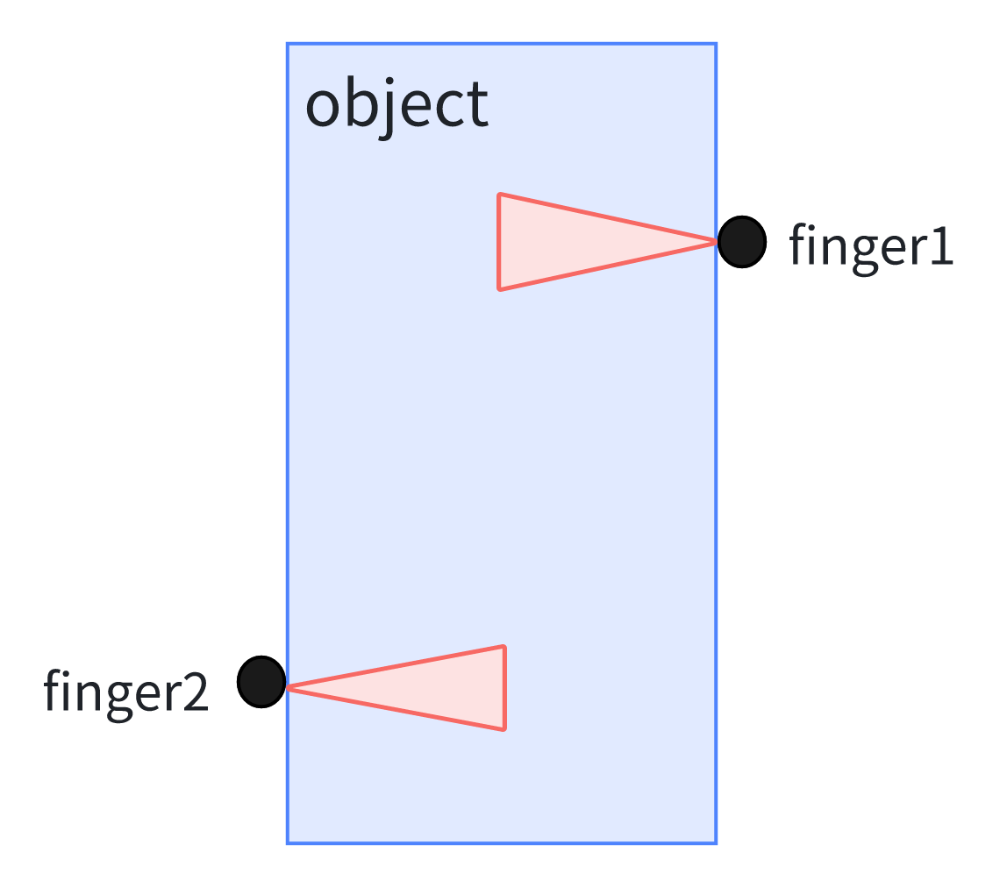

**Last Lecture** 
1. Basic pick and place:
   - single known object
   - assuming known pose
2. Geometric perception
   - single known object
   - unknown pose
3. This week
   - many/diverse unknown objects
   - unknown poses
   - simple task: "clutter clearning"
4. Contact mechanics (friction cones, hydroelastics)
   - not point contact anymore, integral of surface, hydroelastic 

## Today's Topic: 
- What defines a good grasp? what makes a good grasp?
in the 80s, 90s, a lot work on grasp analysis and wrench analysis
deep learning kicked it back in
from known object get some heuristics and extends to unknown objects

## Kinematic analysis
1. Given the object geometry, where to place the two/three fingers?
 
2. A **form closure**: if you found location of your fingers such that your fingers don't move. Basically the object is completely wedged. It cannot rotate and translate
- define $\phi_{i}(q)$, signed distance between finger i and object
- $\forall i, \phi_{i}(q)=0$, $q = [q_{object}, q_{robot}]^T$
- have a **form closure** if $\phi_{i}(q_{object}+\Delta q_{object}+q_{robot}) \geq 0$ (nothing in penetration)
- if satisfying above condition, implies $\Delta q_{object}=0$, then you have a form closure. No rotation of object causing penetration or lose contact of finger
- if the object could fall off hand, then there will be $\Delta q_{object}\neq 0$ exists for $\phi_{i}(q_{object}+\Delta q_{object}+q_{robot}) \geq 0$
- Define form closure in a differential way:
   - $\frac{\partial\phi}{\partial q_{object}}$, rank($\frac{\partial\phi}{\partial q_{object}}$)=6
   - check full condition with small linear program. Tell me where the fingers are, then it tells me whether its a form closure, by solving a small linear program.
- above into conclusion: give a kinematic perturbation of the object, can I break the grsap roughly. 
- Next step: give a force perturbation of the object, can it break the grasp. Current grasp resist that force

## Statics Grasp Analysis
1. Can I resist a spatial force (aka wrench) perturbation? 
   - Example 2D, no rotations:
      - 
      - this grasp resists all force
      - Minkowski sum of two friction cones
      - **force closure**, resists all wrenches
2. Intuition Antipodal Grasps

## Point Cloud Processing, 56'
1. PCL / Open3D

## Questions
### 1. The Hydro-elastics contact, how to do the integration?
- easiest case: do the surface integral, making brushing contact
- next stage, find some balancing surface and on which to integrage

### 2. if the object could fall off hand, does the form closure still hold?
- if the object could fall off hand, then there will be $\Delta q_{object}\neq 0$ exists for $\phi_{i}(q_{object}+\Delta q_{object}+q_{robot}) \geq 0$

