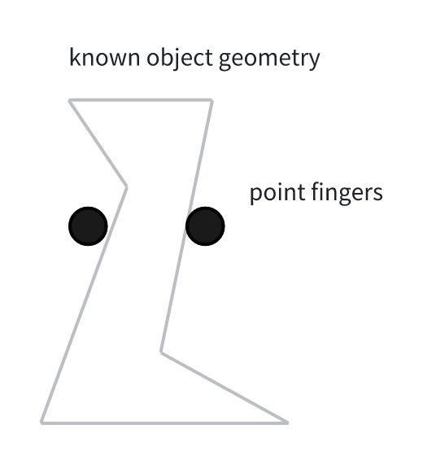

**Last Lecture** 
1. Basic pick and place:
   - single known object
   - assuming known pose
2. Geometric perception
   - single known object
   - unknown pose
3. This week
   - many/diverse unknown objects
   - unknown poses
   - simple task: "clutter clearning"
4. Contact mechanics (friction cones, hydroelastics)
   - not point contact anymore, integral of surface, hydroelastic 

## Today's Topic: 
- What defines a good grasp? what makes a good grasp?
in the 80s, 90s, a lot work on grasp analysis and wrench analysis
deep learning kicked it back in
from known object get some heuristics and extends to unknown objects

## Kinematic analysis
1. Given the object geometry, where to place the two/three fingers?
 
2. A **form closure**: if you found location of your fingers such that your fingers don't move. Basically the object is completely wedged. It cannot rotate and translate

## Horizontal force,
1. Friction Cone, 

## Questions
### 1. The Hydro-elastics contact, how to do the integration?
- easiest case: do the surface integral, making brushing contact
- next stage, find some balancing surface and on which to integrage

