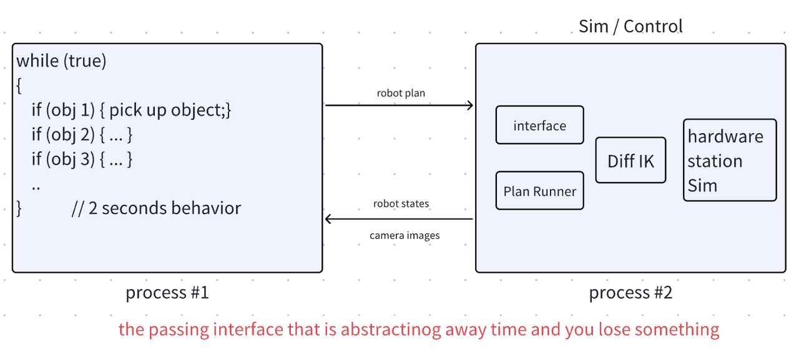
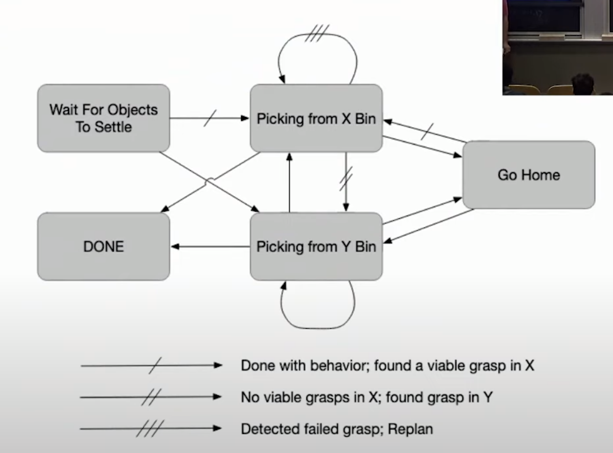
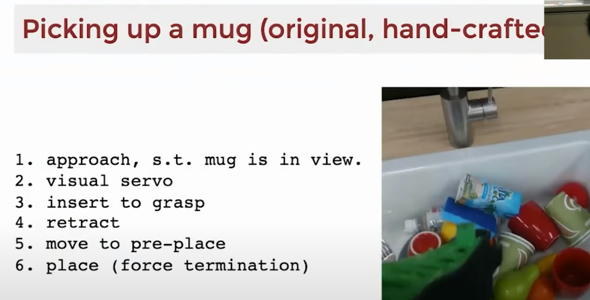
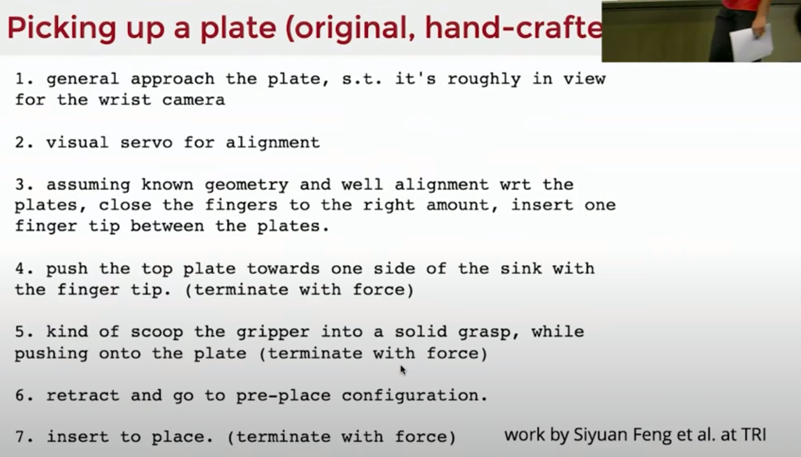
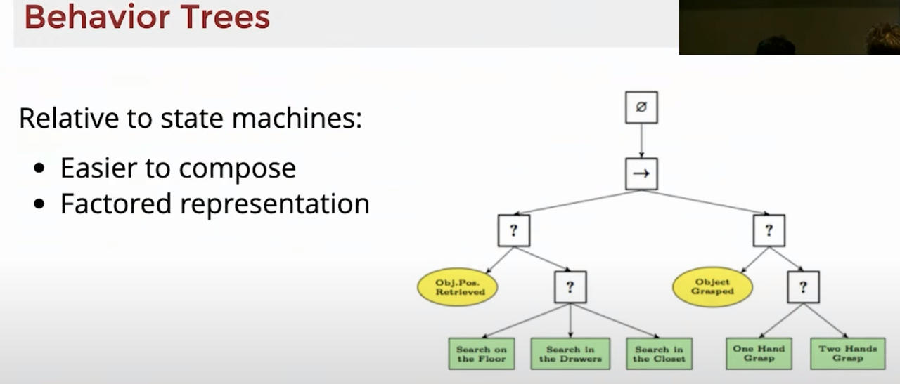
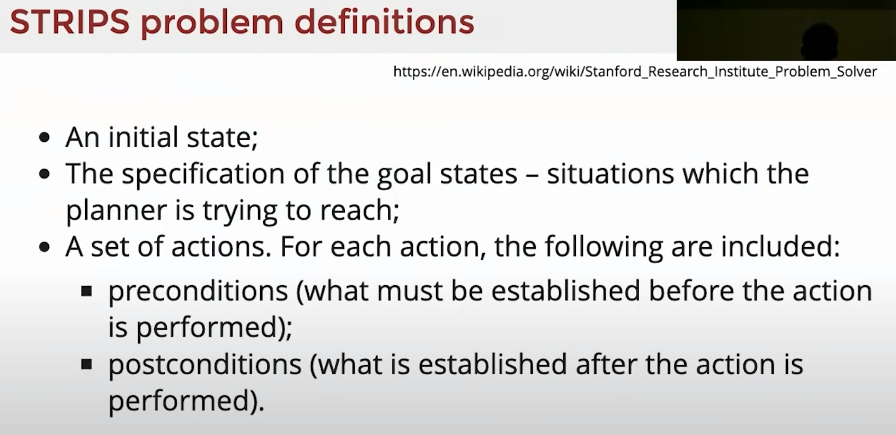
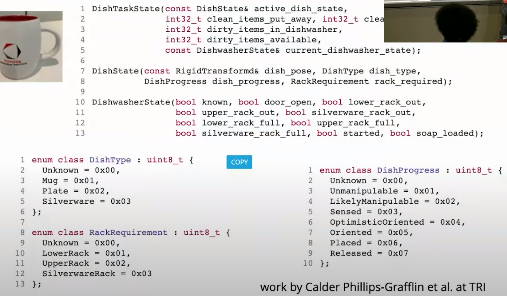

Last Lecture Clutter Clearing
- Random initial conditions
- Point cloud processing
- Grasp selection (antipodal grasps)
- Base Keyframe sketch -> end-effector traj
- Diff IK

Today's Topic outline: task level programming
- Procedural code
```
while (true)
{
    if(obj in bin 1) {do sth 1}
    if(obj in bin 2) {do sth 2}
}
```
- CG(computer graphics) pipeline:
  - the heart of computer graphics code is a render loop, in a standard CG pipeline
    ```
    // Render loop is super important
    while (true)
    {
        // executed long running behavior, much faster
        decideWhatToDraw();
        // send to GPU;
        // this loop is much slower, say 32 frames a second
        render(); 
        // a: execute the following behavior in next 2 seconds
        // b: this gonna breaks render loop, i need to send data to screen 32 frames a sec
    }
    ```
  - How to change your control flow to this feature?
  - similar to low level controllers and low-level simulator
    - build a bridge between fast and slow execution, there are 3 broad classes of how people change the way they write those higher level code
      1. first way, still write procedural code but in separate thread/process
        
      **it breaks the signal + systems abstration**
      2. "Task Policies " (finite state machine, behavior tree)
      3. Task planning (with online replanning), put a task planner into the signals and system abstraction and the feedback loop

1. Finite State Machine (FSM)
  - All of the high level logic is embedded in this discrete state(aka mode)
  - handle all the edge cases, system can be complexed and robust
        
  -  Failure modes of my simple FSM:
    - MultibodyPlant can crash on startup(switched to hyro-elastic, no more deep penetration)
    - Motion planning. Collisions and DiffIK limitations
    - Perception
      - grasp far from object center of mass
      - double-picks
      - phantoms
    - More than pick and place
      - objects stuck in the corner
      - objects too big for the hand
  - Advanced Full-stack integration testing
    - System framework, sophisticated test Suites, full stack integration testing. the fact that things are deterministic given a random seed. Hammering on the system with cloud infrastructure and simulation. If you find a bug, go back and get a reproduction, fix it.  Adding more transition on the edges. They can still have random rollouts
    - Every block of code you should write unit test for that
    - Every module works good but together there are bugs, like plan repeating, this requires higher level sophiscated test
  - Ros smach, task level architecture for rapidly creating complex robot behavior, build hierarchical state machines.

  There is task planner composing each of these lower level state machines. Substate in a bigger state machine

  - task planning, substate in state machine. Language model gonna take over task planning? viable candidate
  - LLM output policy or plan
2. Behavior Trees (comes from computer gaming)

  - Unreal Engine, behavior Tree Quick Start Guide 
  - Behavior Tree vs. FSM
  - Package up Behavior trees into a system
    - py_trees_ros
    - github/drake/...bt_planning/behavior_tree.py
3. Task Planning
  - long term decision, high level long-term reasoning
  - don't write behavior tree(fsm), but write rules of competition, rely on AI-based search. Stanford Research Institute Problem Solver
  strips.pdf

  - Turn task planning into search, turn low-level actions into nodes, higher level task planning doing node search
- Task Leverl PLanners
  - Graph search(A*)
  - Strong Heuristic Search (Fast Forward, Fast Downward)

  - PDDL: planning Domain Definition Language
  - We replan before each action to handle unexpected outcomes


4. Large Language Models
  - how far language models can go with in terms of generating plans
  the robustness and common sense are fantastically good
  - Requires symbol grounding
  - Long-term planning with LLMs: Tree of Thoughts: Deleberate Problem Solving with LLM
  Tree of Thoughts Deliberate Problem Solving with Large Language Models.pdf
- GPT-4V(ision)
- Summarize, Programming the task level
  - Procedural code + message passing
  - state machines / behavior trees
  - Task planning (with online replanning)
  - LLMs can potentially generate plans or simple policies; but it's not clear yet how far this will go