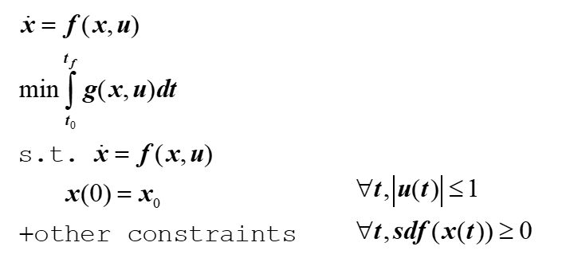

Trajectory Optimization
- Dynamic Programming solve $$J^{*}(x)$$(cost to go)
  - On a mesh (complexity in high dof and had problem in discretilization)
  - Neural value iteration(less guarantees, dont know when to converge when to fail)
- LQR
  - High dimensions works okay, scales well
  - Linearization, only valid for a limited domain around fixed point
- Sum Of Squares / lyapunov via SDP/SOS

Trajectory Optimization
- Solve problems in higher dimensions, fundamentally
  - One single initial condition, single trajectory
- Basic trajectory optimization formulation
- 
  sdf:signed distance function, representing the outlier of x to world nearest distance
- Topic 3

