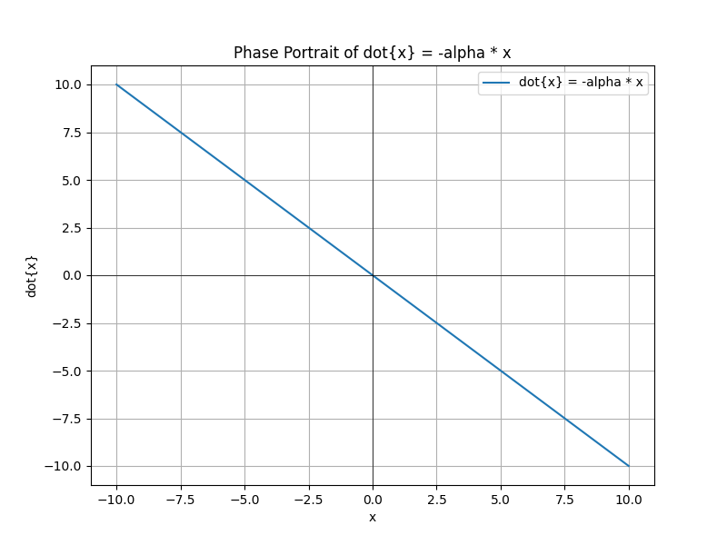
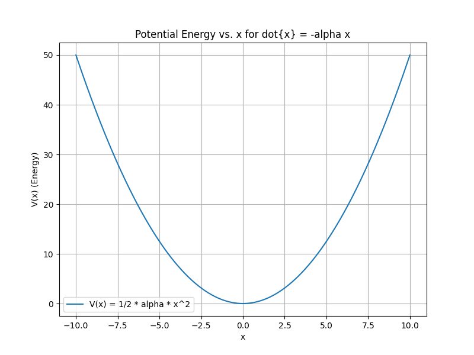
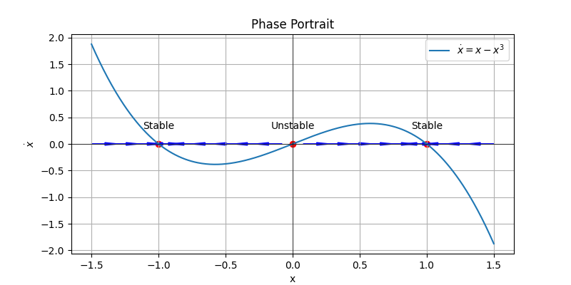
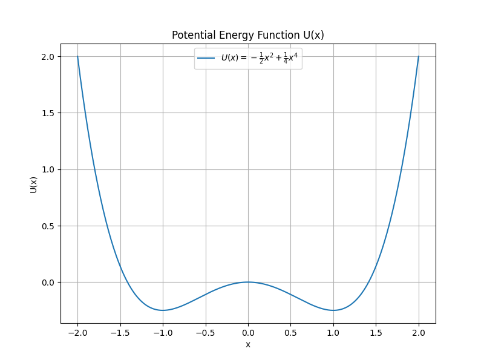

**So far we have learned** 
**1**: $\dot{x}=f(x,u)$
**2**: $x[n+1]=f(x[n], u[n])$

# Today's Topic: Stochastic Dynamics
#### Adding noise in the differential equation
- $\dot{x} = f(x,u,w)$,  $w(t)$: random vector
- $x[n+1]=f(x[n],u[n],w[n])$, $w[n]$: the outcome of a random process
- $x[n+1]=f(x[n],u[n]) + w[n]$
- w can model disturbances, or model parameter uncertainty
- **process noise** vs **measurement noise**
- today we more focus on the process noise
  - $x[n+1]=f(x[n],u[n],w[n])$
  - $x[n+1]=f(x[n],u[n]) + w[n]$

#### a linear system example
- $\dot{x}=- \alpha x$, $\alpha > 0$
- the phase protrait and potential energy are

  
  

- Discrete-time approximation 
  - $x[n+1] = x[n] +hf(x[n]) = x[n] -\alpha x[n]$
  - $x[n+1] = x[n] -\alpha x[n] + w[n]$, add process noise
  - The expectation of noise is zero: $E[w[n]]=0$
  - Process noise has a property of normal distribution with zero mean and variance
  - iid, Independent Identically Distributed
  - $w[n] \propto N(0,\sigma^2) $,  0 is mean, $\sigma$ is variance
  - $E[w[n], w[m]] = \begin{Bmatrix}
\sigma^2, n=m\\
0, else
\end{Bmatrix}$ 
  - think about a probability distribution, x[n] is now a random variable. Need to reason about $P_n (x)$, probability density 
  - keep picture in head: even starting at fixed point, noise will make in bounce around

#### more interesting example
- diff equation: $\dot{x}=x-x^3$
- potential energy: $U(x) = -\frac{1}{2}x^2+\frac{1}{4}x^4$

  
  

# Questions:
1. **question 1**
   - answer

